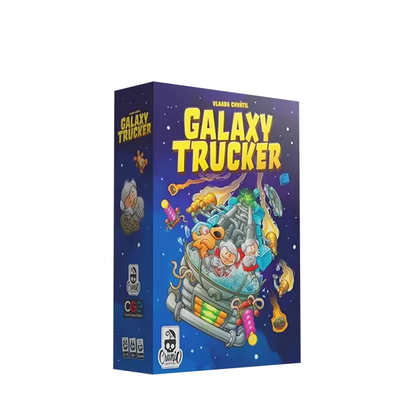
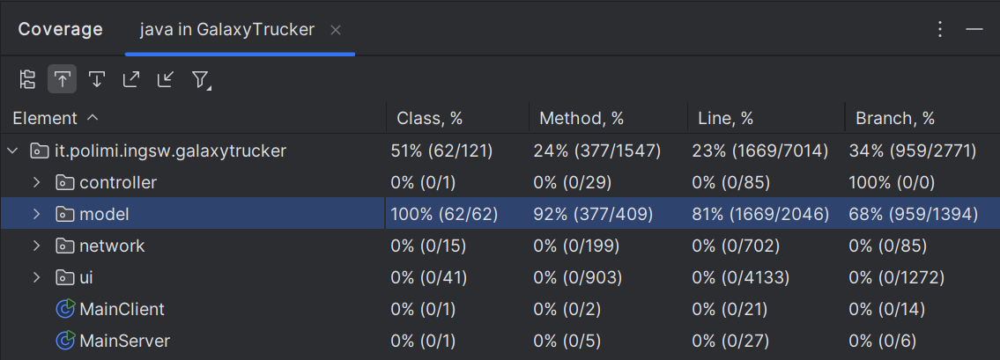

# Galaxy Trucker

# Software Engineering Project

## Project Overview
This project is a Java-based implementation of the table game Galaxy Trucker developed at Politecnico di Milano. The team members are Bonora Lorenzo, Bove Thomas, Dal Monte Nicolò, Valentini Filippo.
The implementation features both a command-line interface (CLI) and a JavaFX graphical user interface.

## Task reached:
| Feature | Implemented |
|:------- |:----------- |
| Complete rules | ✅ |
| TUI | ✅ |
| GUI | ✅ |
| RMI | ✅ |
| Socket | ✅ |
| Level one flight | ✅ |
| Multiple games | ✅ |
| Persistence | :x: |
| Resilience to clients disconnections | :x: |

## Prerquisites
It is required [Java 23](https://www.oracle.com/java/technologies/javase/jdk23-archive-downloads.html) (or higher) to run the applications.

## Executables
The jar exectuables are available at [jar artifacts](https://github.com/filippovalentini/IS24-AM36/tree/main/deliveries/GalaxyTrucker/out/artifacts).

## How to run Galaxy Trucker
### Server
1. Get the artifact from [server jar](https://github.com/filippovalentini/IS24-AM36/tree/main/deliveries/GalaxyTrucker/out/artifacts/ServerGalaxyTrucker)
2. Run `java -jar ServerGalaxyTrucker.jar [HOST_IP]`
3. (Optional) Run with custom ports `java -jar ServerGalaxyTrucker.jar [HOST_IP] --port [RMI_PORT] [SOCKET_PORT]`
### Client
#### Windows
1. Get the artifact from [client jar](https://github.com/filippovalentini/IS24-AM36/tree/main/deliveries/GalaxyTrucker/out/artifacts/ClientGalaxyTrucker)
2. Run `java -jar ClientGalaxyTrucker.jar` it will present an option to select between the Text User Interface (TUI) and the Graphical User Interface (GUI) via console input
3. (Optional) Run directly with TUI `java -jar ClientGalaxyTrucker.jar --tui`
4. (Optional) Run directly with GUI `java -jar ClientGalaxyTrucker.jar --gui`
5. (Optional) Run with custom ports: when ip is asked insert the ip as `IP:PORT`
#### Mac/Linux
1. Get the artifact from [client jar](https://github.com/filippovalentini/IS24-AM36/tree/main/deliveries/GalaxyTrucker/out/artifacts/ClientGalaxyTrucker)
2. Run `java --module-path "[PATH_TO_JavaFX_SDK]/lib" --add-modules javafx.controls,javafx.fxml -jar ClientGalaxyTrucker.jar` it will present an option to select between the Text User Interface (TUI) and the Graphical User Interface (GUI) via console input
3. (Optional) Run directly with TUI `java -jar ClientGalaxyTrucker.jar --tui`
4. (Optional) Run directly with GUI `java --module-path "[PATH_TO_JavaFX_SDK]/lib" --add-modules javafx.controls,javafx.fxml -jar ClientGalaxyTrucker.jar --gui`
5. (Optional) Run with custom ports: when ip is asked insert the ip as `IP:PORT`

## Testing
The tests achieved >80% line coverage on model.
Since the controller contains no logic and its methods are void, controller tests were performed using the final application.
There are also classes for testing the GUI indipendently (`TestGUI.java` and `TestEndgameGUI.java`).

